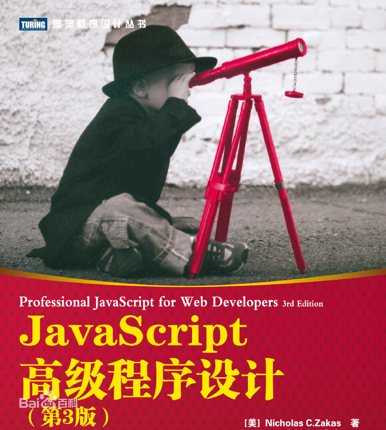
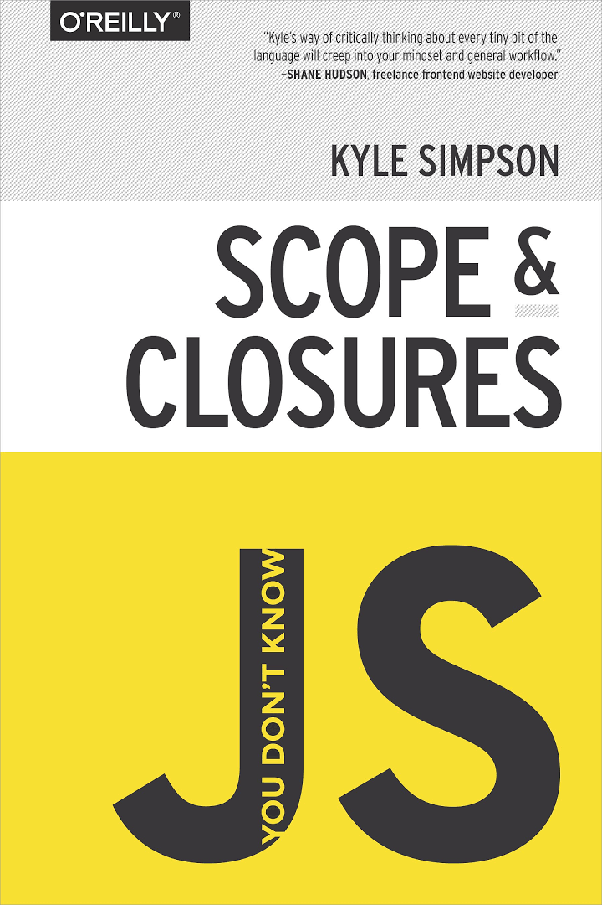

## Web前端开发名词解释会

@lanyang

---
<!-- style: align-items:flex-start; -->

```html
<p id="paragraph" class="red">一段文字</p>
```
```css
.red {  color: red; }
```
```js
document
    .getElementById('paragraph')
    .addEventListener('click'， () => { 
        // do something
    });
```

---

### W3C小组 & TC39 委员会

- [W3C](https://github.com/w3c)
- [TC39](https://github.com/tc39)， Proposals-Stage
    - [如何参与 Web 标准讨论](https://www.zhihu.com/question/21508830/answer/18456376)
- ES6 - ECMA2015
- HTML5 与 WHATWG
- CSS3
    - 

---

### JavaScript

- 各厂引擎各自实现
    - [Promise 实现与差异](https://jakearchibald.com/2015/tasks-microtasks-queues-and-schedules/)
- 模块化，CommonJS、AMD、CMD 以及 ES6 Module.mjs
    - [模块化七日谈](https://github.com/Huxpro/js-module-7day)
    - 前端构建
- Polyfill & [Babel](https://github.com/babel/babel)
- [TypeScript](https://github.com/Microsoft/TypeScript) JS 的超集
- [NodeJS](https://github.com/nodejs/node) (V8 + libuv (跨平台事件驱动异步IO框架) + API binding)
- [Deno](https://github.com/denoland/deno)

---

### 浏览器

<a href="https://groups.google.com/a/chromium.org/forum/#!topic/blink-dev/AK_rwEp61ME" style="font-size: .7em;">https://groups.google.com/a/chromium.org/forum/#!topic/blink-dev/AK_rwEp61ME</a>

- SKIA
- CSS / JS 的全局污染
- JavaScript 独立的单线程，运行会阻塞渲染（行为丢失/白屏
- [视频中文版](https://www.bilibili.com/video/av35265997?from=search&seid=8190571885546653028)

---

### 早期的前端开发
- 后端为主的 MVC 时代
- 模版技术
    - 变量
    - 流程控制
- 文件分离 & 混写

---

### 前后端分离
- [Ajax](https://en.wikipedia.org/wiki/Ajax_(programming))  */ˈāˌjaks/ 2005*
- [SPA](https://en.wikipedia.org/wiki/Single-page_application)
    - Gmail *2004*
- CDN 广泛应用
- 复杂度迁移到前端
- 前端框架
    - 传统的 MVC - template/controller
        - backbone
        - ExtJS
        - ..
    - MVVM

---

### 浏览器中的 MVVM
- 组件化
- 双向绑定
    - 手动更新变自动更新
- Angular *2010*
    - .directive 
    - .module
    - .factory
    - ...
- Vue = 比 Angular 更好的更新策略 / 简单的语法 / 官方配套设施 *2014*

---

### 浏览器中的 MVVM

- [Vue 组件化](https://cn.vuejs.org/v2/guide/components.html#%E7%BB%84%E4%BB%B6%E7%9A%84%E7%BB%84%E7%BB%87)
- [Vue 组件生命周期图示](https://cn.vuejs.org/v2/guide/instance.html#%E7%94%9F%E5%91%BD%E5%91%A8%E6%9C%9F%E5%9B%BE%E7%A4%BA)

---

### React - ALL IN JS
- UI = F（state）
- Virtual DOM
    - learn once， write anywhere
    - diff
- patch
    - Recat Native
- Flux

---

### Flux 思想
- 
- 单向数据流
- 优缺点
- Redux

---

### 共识
- 组件化
    - 声明式
    - 生命周期
- Virtual DOM
- 单向数据流
- 局部状态与 global store 共存

---

- [React Increase Demo](https://codesandbox.io/s/rl4mxkwo9o)
- [Vue Increase Demo](https://codesandbox.io/s/4jxnl9n1m0)

---

### 开发之前 - 基于 NodeJS 的预处理
- babel / TypeScript
- 模块化依赖打包
    - 处理静态资源
- 压缩
- 方言翻译
    - coffee （js 方言
    - less / sass （模块化 css
    - ejs pug/jade （模版

---

### 开发之前 - 构建工具
- bowserfiy + watchfiy + babelfiy
- Webpack
- Gulp - 构建任务管理工具
- Gulp + Webpack + hot-reload-server
- 官方 / 社区里的包装版

--- 

### 开发之前 - 其他
- 代码规范 - eslint / tslint
- 代码美化 - prettier
- 测试 -（

--- 

### 框架对比
||Angular|Vue|React|其他|
|:----:|:-----:|:------:|:------:|:------:|
|脚手架|√|√|难以抉择|emm..|
|debug插件|√|√|√|emm..|
|router|√|√|难以抉择|emm..|
|store|√|√|难以抉择|emm..|
|组件库|√|x|x|emm..|
|TypeScript|需要|支持|支持|emm..|
|学习成本|较高|简单|简单|emm..|
|社区|(不清楚|很好|很好|emm..|

---

### 福尔摩斯
- React
- babel + less
- dva （redux + redux-saga
- umi （黑科技
- Ant Design
- Nginx

---

### 如何快速参与福尔摩斯前端开发

1. Ajax 与 SPA
2. ES2015+ 语法基础 
3. React 基础
    - 组件化思想 & 组件的生命周期
    - props / state
    - JSX 模版语法
4. Dva 状态管理
5. ~~构建打包~~

---

### 如何快速精通 JS（误




---

### 我理解的前端开发

- 创造体验良好的**人机交互**
    - 引导输入
    - 给予反馈

---

### Thanks!

Q&A

--- 